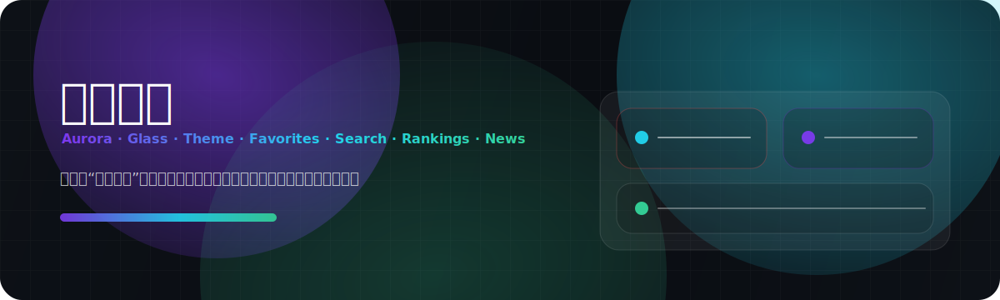

<div align="center">
  
  <h1>Guoman World</h1>
  <p>
    A futuristic Guoman discovery hub · Frontend-only · Local-first · Detail-obsessed
  </p>
  <p>
    <a href="README.md">简体中文</a>
    ·
    <strong>English</strong>
  </p>
  <p>
    <a href="https://tur1412.github.io/Guoman/">Live Demo</a>
    ·
    <a href="#-highlights">Highlights</a>
    ·
    <a href="#-feature-matrix">Feature Matrix</a>
    ·
    <a href="#-quick-start">Quick Start</a>
    ·
    <a href="#-deployment">Deployment</a>
  </p>
</div>

---

## ✨ Highlights

- **Futuristic design language**: aurora mesh, glass layers, modern typography, cinematic depth.
- **Content insights**: Tag Pulse, Studio Radar, Audience Pulse summaries.
- **Watch Planner**: turns progress + following status into daily viewing budgets and ETA.
- **Match score + reasons**: recommendations are explainable and transparent.
- **Command Palette upgrades**: jump to titles / `#tags` / categories / pages; search stays as a fallback item, and highlighted targets are idle-prefetched for snappier navigation.
- **Local-first**: favorites, progress, taste profile, and visual settings are persisted in `localStorage`.
- **PWA & diagnostics**: offline caching + update prompt + `/diagnostics` local health snapshot.
- **Observability**: local logs and INP tracking for faster debugging of interaction issues.
- **Crash recovery**: ErrorBoundary provides one-click copy/download diagnostics bundles (logs + errors + health snapshot), with manual-copy fallback and optional `.json.gz` export.
- **Diagnostics replay**: import `.json` / `.json.gz` bundles in `/diagnostics` to inspect summaries locally (no upload).
- **Resilient lazy loading**: automatic retry for dynamic-import failures (flaky networks, stale caches, or chunk mismatch).

---

## ✅ Feature Matrix

| Module                | Capabilities                                                                  |
| --------------------- | ----------------------------------------------------------------------------- |
| Explore & Recommend   | Taste profile, local recommendations, match explanations, tag momentum        |
| Follow & Plan         | Following reminders, watch progress, Watch Planner, remaining-time estimation |
| Insights & Analytics  | Studio Radar, Audience Pulse, viewing history, achievements                   |
| Visual Experience     | Futuristic themes, glassmorphism, responsive grid system, motion guardrails   |
| Data Management       | Favorites/groups/import/export/Data Vault, local usage metrics                |
| Quality & Reliability | PWA, diagnostics, bundle budget gate, error boundaries                        |

---

## ⌨️ Command Palette Tips

- Open: **Ctrl/⌘ + K**
- Type an anime title to jump to details (e.g. `斗罗大陆`)
- Type `#tag` to jump to a Tag page (e.g. `#玄幻`)
- Type `category` / `分类` / `action` etc. to jump to Category pages
- Search action is always available as the last item when a query is present

---

## 🧩 Tech Stack

| Area   | Tech                                                         |
| ------ | ------------------------------------------------------------ |
| UI     | React 18 + styled-components + Design Tokens (CSS Variables) |
| Router | React Router (Hash Router)                                   |
| Motion | Framer Motion                                                |
| Build  | Vite 6                                                       |
| Tests  | Vitest + Testing Library                                     |
| PWA    | Web App Manifest + Service Worker                            |
| Deploy | GitHub Actions → GitHub Pages                                |

---

## 🚀 Quick Start

> Node.js v18+ recommended (aligned with GitHub Actions).

```bash
npm ci
npm run dev
```

---

## ✅ Quality Gates

```bash
npm run check
```

Runs: Prettier → ESLint → Vitest → Build → Bundle Budget.

---

## 🚢 Deployment

- `vite.config.js` is configured with `base: '/Guoman/'` for GitHub Pages.
- GitHub Actions builds and publishes `dist/` on every push to the default branch.
- Enable Pages: `Settings → Pages → GitHub Actions`

---

## 📚 Docs

- `docs/ARCHITECTURE.md` — architecture notes and decisions
- `docs/DESIGN_TOKENS.md` — design tokens and UI conventions
- `docs/DIAGNOSTICS.md` — diagnostics & performance budget
- `docs/QUARK_AUDIT.md` — quark-level audit and improvement backlog
- `docs/ITERATIONS.md` — atomic iteration records

---

## 🤝 Contributing & Security

- Contributing guide: `CONTRIBUTING.md`
- Code of conduct: `CODE_OF_CONDUCT.md`
- Security policy: `SECURITY.md`

---

## 📄 License

MIT
