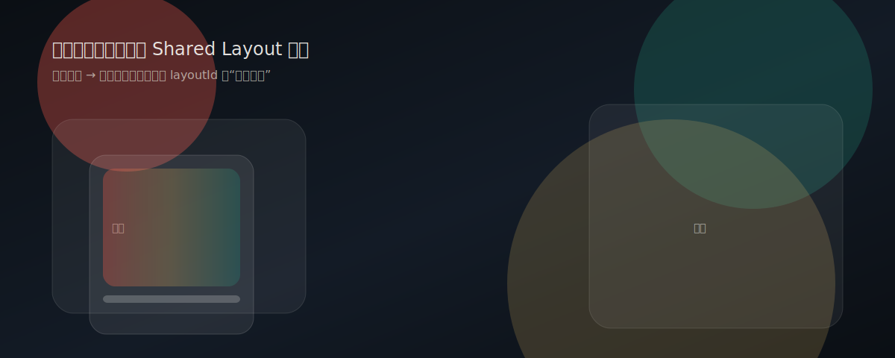
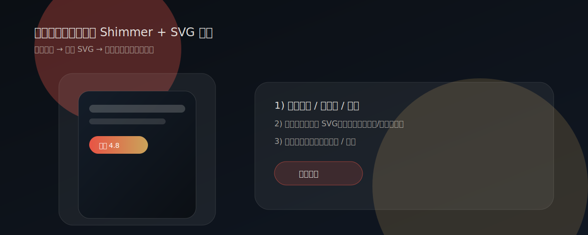
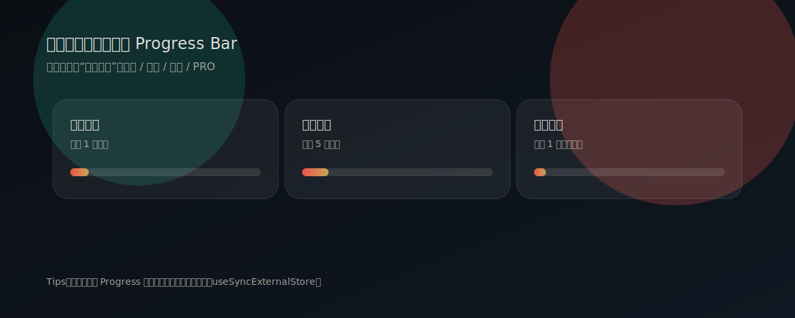

<div align="center">
  

  <h1>国漫世界 (Guoman World)</h1>

  <p>
    墨韵国风 × 极光光晕的国漫探索站（纯前端 · 静态部署 · 本地优先）。
    <br />
    收藏 · 追更中心 · Taste Engine 推荐 · 海报工坊 · 足迹中心 · 成就系统 · 数据 Vault
  </p>

  <p>
    <a href="https://tur1412.github.io/Guoman/">在线预览</a>
    ·
    <a href="#-功能一览">功能一览</a>
    ·
    <a href="#-架构一览">架构一览</a>
    ·
    <a href="#-快速开始">快速开始</a>
    ·
    <a href="#-部署到-github-pages">部署</a>
  </p>

  <p>
    
    
    
    
    
    
    
    
  </p>
</div>

---

## ✨ 目录

- [项目亮点](#-项目亮点)
- [功能一览](#-功能一览)
- [动效演示](#-动效演示)
- [架构一览](#-架构一览)
- [技术栈](#-技术栈)
- [项目结构](#-项目结构)
- [快速开始](#-快速开始)
- [部署到 GitHub Pages](#-部署到-github-pages)
- [设计与可访问性](#-设计与可访问性)
- [文档](#-文档)
- [Roadmap](#-roadmap)
- [贡献与安全](#-贡献与安全)
- [许可证](#-许可证)

---

## 🌟 项目亮点

- **墨韵国风 UI**：纸感纹理 + Aurora Mesh + Glass 层级（拒绝死白/死黑）
- **本地优先 (Local-first)**：收藏 / 观看进度 / 搜索 / 偏好等全量写入 `localStorage`
- **命令面板**：`Ctrl/⌘ + K` 全局命令入口（搜索 / 跳转 / 快捷动作）
- **影院级微交互**：Shared Layout 过渡、悬浮/按压反馈、Shimmer/Focus 动效护栏
- **增长裂变模块**：海报工坊（SVG 导出 + 历史管理）+ 足迹中心 + 成就系统
- **数据管理**：用户中心支持导入/导出/清理，并显示本地占用体积
- **弱网/离线提示**：自动识别离线/省流/2G 环境，提供友好提示
- **稳健兜底**：Error Boundary + 友好空状态 + 性能/错误监控钩子

---

## ✅ 功能一览

- 🎴 **视觉体系**：墨韵纸感 + Aurora 渐变 + Glassmorphism + 微边框层级
- 🎛️ **主题切换**：深/浅主题一键切换并持久化（主题原子性）
- ⏱️ **观看进度**：集数 + 进度滑条 + 继续观看入口（本地保存）
- 🔍 **站内搜索**：多关键词搜索（标题/原名/类型/标签/制作方）+ 搜索缓存管理
- ❤️ **收藏系统**：收藏页、卡片角标、分组管理、导入/导出、本地持久化
- 🔔 **追更中心**：一键追更 + 提醒时间（站内通知）+ 测试通知
- ⭐ **Taste Engine 推荐**：基于收藏/进度/搜索词生成本地口味画像并排序推荐
- 🖼️ **海报工坊**：生成可分享的 SVG 海报 + Shimmer 预览 + 历史管理
- 📈 **足迹中心**：播放/下载/分享足迹时间线 + 一键清理（留存视角）
- 🏅 **成就系统**：进度条化反馈（收藏/追更/分享/PRO），增强可玩性
- 📌 **本地数据 Vault**：导出/导入（合并/覆盖）+ 分模块清理 + 占用统计
- 🏆 **排行榜**：评分/人气切换，Top 卡片强化
- 📰 **资讯模块**：资讯列表 + 详情页（可替换真实 API）
- 🧭 **路由完备**：分类页/标签页/静态页/404 深链兜底

---

## 🎬 动效演示

> README 内嵌为可动 SVG（无需额外依赖），用于展示“影院级微交互”的节奏与风格取向。

<div align="center">
  
  
  
</div>

## 🧠 架构一览

> 该项目是典型的“静态站 + 本地状态”架构：页面与数据完全前端化，部署到 GitHub Pages。

```mermaid
flowchart TD
  User[用户] --> Browser[浏览器]
  Browser --> App[React SPA]

  App --> Router[React Router (Hash)]
  App --> UI[UI Components (styled-components)]
  App --> Motion[Motion (Framer Motion)]

  App --> Data[Local-first Data Layer]
  Data --> LS[(localStorage)]
  Data --> Queue[storageQueue: 合并写入/空闲刷新]

  subgraph Build[构建与部署]
    Vite[Vite Build] --> Dist[dist/]
    Actions[GitHub Actions] --> Dist
    Dist --> Pages[GitHub Pages]
  end
```

核心设计决策与更多细节：见 `docs/ARCHITECTURE.md`

---

## 🧩 技术栈

| 模块 | 技术                                               |
| ---- | -------------------------------------------------- |
| 框架 | React 18                                           |
| 构建 | Vite 6                                             |
| 路由 | React Router（Hash Router / `createHashRouter`）   |
| 动效 | Framer Motion                                      |
| 样式 | styled-components + Design Tokens（CSS Variables） |
| 测试 | Vitest + Testing Library                           |
| 部署 | GitHub Actions → GitHub Pages                      |

---

## 🗂️ 项目结构

```txt
.
├── docs/                  # 文档与展示素材
├── public/                # 静态资源（manifest/favicon）
├── scripts/               # SEO / bundle / lighthouse 等脚本
├── src/
│   ├── assets/            # 图片/样式
│   ├── components/        # 组件与 Providers
│   ├── data/              # 模拟数据（可替换为真实 API）
│   ├── pages/             # 页面级路由
│   ├── utils/             # 本地数据层 / 监控 / SEO 等工具
│   ├── App.jsx            # 根路由与布局
│   └── index.jsx          # 应用入口（主题/监控初始化）
├── 404.html               # GitHub Pages 深链兜底
├── index.html             # 首屏主题初始化 + 字体引入
└── vite.config.js         # build base 为 /Guoman/
```

---

## 🚀 快速开始

> 建议 Node.js v18+（与 GitHub Actions 构建环境一致）

### 1) 安装依赖

```bash
npm ci
```

### 2) 开发模式

```bash
npm run dev
```

### 3) 质量闸门（推荐提交前执行）

```bash
npm run check
```

`check` 会依次执行：Prettier → ESLint → Vitest → Build。

---

## 🚢 部署到 GitHub Pages

该仓库默认通过 GitHub Actions 自动部署到 GitHub Pages（见 `.github/workflows/static.yml`）。

### 1) 确认 Vite base

GitHub Pages 的站点通常挂在 `/<repoName>/` 下，所以 `vite.config.js` 在 build 时使用：

- `base: command === 'build' ? '/Guoman/' : '/'`

如果你 fork 到自己的仓库名（例如 `MyGuoman`），请同步把 base 改为：

- `'/MyGuoman/'`

### 2) 开启 Pages

在 GitHub 仓库设置：

- `Settings` → `Pages`
- Source 选择 `GitHub Actions`

### 3) 构建与发布

每次 push 到默认分支会触发 workflow：

- `npm ci`
- `npm run build`
- 发布 `dist/` 到 Pages

### 4) 深链（404 兜底）

由于 GitHub Pages 对 SPA 深链支持有限，本项目提供：

- `404.html`：将路径转换为 Hash 路由，避免刷新 404
- `.nojekyll`：避免 Jekyll 干预文件路径

更多说明：`docs/DEPLOYMENT.md`

---

## 🎨 设计与可访问性

- **主题原子性**：背景/文字/边框/卡片同步切换，避免“浅底浅字”
- **可读性**：关键文案对比度满足 WCAG AA
- **动效护栏**：尊重 `prefers-reduced-motion`
- **对象恒常性**：主题/收藏/进度等核心状态写入 `localStorage`
- **语义补齐**：主内容/列表/提示区具备语义与 `aria-live`

---

## 📚 文档

- `docs/ARCHITECTURE.md`：架构说明与关键决策
- `docs/DESIGN_TOKENS.md`：设计变量与组件规范
- `docs/QUARK_AUDIT.md`：夸克级审计与改进清单
- `docs/QUARK_BACKLOG_1000.md`：1000 微任务全量清单
- `docs/ITERATIONS.md`：迭代记录（原子级提交）

---

## 🧭 Roadmap

- [ ] 接入真实后端（账号/收藏云同步/评论）
- [ ] 内容扩展（更丰富作品与标签体系）
- [ ] 性能升级（更细粒度拆包、预取策略）

---

## 🤝 贡献与安全

- 贡献指南：`CONTRIBUTING.md`
- 行为准则：`CODE_OF_CONDUCT.md`
- 安全问题：`SECURITY.md`

---

## 📄 许可证

MIT
