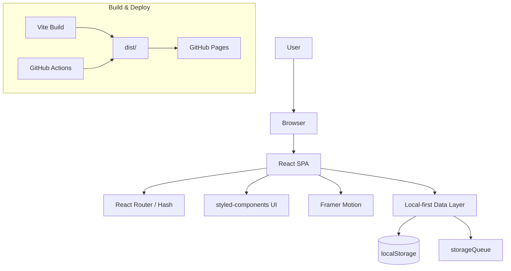

<div align="center">
  
  <h1>国漫世界 Guoman World</h1>
  <p>
    Vercel/Apple 级视觉的国漫探索中枢 · 纯前端 · 本地优先 · 细节控
    <br />
    A Vercel/Apple-grade Guoman discovery hub · Frontend-only · Local-first · Detail-obsessed
  </p>
  <p>
    <strong>简体中文</strong>
    ·
    <a href="README.en.md">English</a>
  </p>
  <p>
    <a href="https://tur1412.github.io/Guoman/">在线预览</a>
    ·
    <a href="#-项目亮点--highlights">项目亮点</a>
    ·
    <a href="#-功能矩阵--feature-matrix">功能矩阵</a>
    ·
    <a href="#-快速开始--quick-start">快速开始</a>
    ·
    <a href="#-部署到-github-pages--deployment">部署</a>
  </p>
  <p>
    
    
    
    
    
    
    
    
    
    
  </p>
</div>

---

## ✨ 项目亮点 | Highlights

- **Vercel/Apple 风格视觉体系**：中性底色 + 光谱 Mesh + 玻璃层级 + 精准排版 + 物理微交互（hover-safe + pointer glow），追求像素级秩序与层次。<br />
  **Vercel/Apple-style Visual System**: neutral surfaces, spectral mesh, glass layers, precision typography, and physics-based micro-interactions (hover-safe guardrails + pointer glow).
- **内容智能洞察**：Tag Pulse 标签趋势、Studio Radar 工作室雷达、Audience Pulse 口碑脉冲。<br />
  **Content Insights**: tag momentum, studio radar, and audience pulse summaries.
- **观影计划器**：结合追更与观看进度，计算剩余时长与每日观看预算。<br />
  **Watch Planner**: turns progress into daily viewing budgets and ETA.
- **匹配度解释**：推荐卡片展示匹配度 + 推荐理由，让“为什么推荐”可视化。<br />
  **Match Score + Reasons**: transparent recommendation explanations.
- **本地优先**：收藏/进度/口味画像/视觉偏好全部 localStorage 持久化。<br />
  **Local-first**: all key user state stays in the browser.
- **命令面板升级**：支持作品/标签/分类直达，搜索建议作为“兜底项”保留，并在高亮/hover 时自动预取目标路由（更快跳转）。<br />
  **Command Palette Upgrades**: jump to titles/tags/categories, keep search as a fallback, and idle-prefetch highlighted targets for faster navigation.
- **性能 & 质量闸门**：Lighthouse 友好、Bundle Budget、ESLint + Vitest 全链路守门。<br />
  **Performance & Quality Gates**: lint, test, build, and bundle budget in CI.
- **可观测性**：本地日志（log store）+ 本地埋点事件（event store）+ 诊断面板 logs/errors/events 浏览器（支持导入回放），并补齐 INP 指标用于交互体验排障。<br />
  **Observability**: local logs + local analytics events + diagnostics replay (logs/errors/events), with INP tracked for interaction debugging.
- **崩溃兜底**：ErrorBoundary 支持复制/下载诊断包（logs + errors + health snapshot），复制失败会自动打开手动复制窗口，并在支持时可下载 `.json.gz` 压缩包。<br />
  **Crash Recovery**: error boundary can copy/download a diagnostics bundle (logs + errors + health snapshot), with manual-copy fallback and optional `.json.gz` export.
- **诊断回放**：诊断面板支持导入 `.json` / `.json.gz` 诊断包（拖拽/点击导入区域），本地解析展示摘要，并可直接浏览导入包内 logs/errors/events（关键词/级别筛选、事件名筛选、展开详情、下载筛选结果），提供本地/导入时间线（breadcrumbs）聚合视图，并支持在时间线中一键定位到对应浏览器（不出网）。<br />
  **Diagnostics Replay**: import `.json` / `.json.gz` bundles via drag-and-drop (or click the import zone), inspect summaries locally, browse imported logs/errors/events with query/level/name filters, use local/imported aggregated timeline (breadcrumbs) views, and drill down from timeline entries to explorers — no upload.
- **稳定性**：路由懒加载 dynamic import 失败自动重试，并写入本地日志（应对弱网/缓存不一致）。<br />
  **Resilient Lazy Loading**: automatic retry on dynamic-import failures, with local logs for troubleshooting.
- **离线兜底页**：Service Worker 增加离线页面 fallback，弱网/断网更可控。<br />
  **Offline Fallback**: a dedicated offline page fallback for more resilient navigation.

---

## ✅ 功能矩阵 | Feature Matrix

| 模块 Module | 能力 Capabilities                                 |
| ----------- | ------------------------------------------------- |
| 探索 & 推荐 | 口味画像、本地推荐、匹配度解释、标签趋势热力      |
| 追更 & 计划 | 追更提醒、观看进度、观影计划器、剩余时长估算      |
| 洞察与分析  | Studio Radar、Audience Pulse、足迹中心、成就系统  |
| 视觉体验    | Vercel/Apple 风格主题、玻璃拟态、微交互、动效护栏 |
| 数据管理    | 收藏/分组/导入导出/Data Vault、本地占用统计       |
| 质量保障    | PWA、诊断面板、性能预算闸门、错误兜底             |

---

## 🧭 内容洞察 | Content Insights

- **Tag Pulse**：基于评分/人气/覆盖量输出势能标签。
- **Studio Radar**：识别高口碑工作室与代表作。
- **Audience Pulse**：用热度指数/均分/关键词总结口碑氛围。
- **Insight Cards**：推荐卡片补齐匹配度与理由。

---

## 🎨 视觉系统 | Design Language

- **字体体系**：Space Grotesk + Chakra Petch（科技感 Display），中文衬底 Noto / ZCOOL。
- **设计 Tokens**：中性底色 + 光谱点缀，黄金比例排版、12 栅格、玻璃卡片、0-12 阴影深度。
- **动效体系**：Framer Motion 弹簧预设（Route/Dialog/Toast）+ CSS 微交互（pressable/card），并提供 Reduced Motion 与低数据模式自动降载。
- **微交互细节**：Button 内置 sheen 覆盖层（hover/focus-visible 触发）+ press 质感、`data-pointer-glow` 指针辉光、`scrollbar-gutter: stable` 布局稳定策略与滚动条 thumb hover/active 质感，追求每次点击/悬停/聚焦/转场的“物理直觉”一致性。

---

## 🧠 架构一览 | Architecture



---

## 🧩 技术栈 | Tech Stack

| 模块 | 技术                              |
| ---- | --------------------------------- |
| 框架 | React 18                          |
| 构建 | Vite 6                            |
| 路由 | React Router (Hash Router)        |
| 动效 | Framer Motion                     |
| 样式 | styled-components + Design Tokens |
| PWA  | Web App Manifest + Service Worker |
| 测试 | Vitest + Testing Library          |
| 部署 | GitHub Actions → GitHub Pages     |

---

## 🗂️ 项目结构 | Structure

```txt
.
├── docs/                  # 文档与展示素材
├── public/                # 静态资源（manifest/favicon/sw）
├── scripts/               # SEO / bundle / lighthouse 等脚本
├── src/
│   ├── assets/            # 图片/样式
│   ├── components/        # 组件与 Providers
│   ├── data/              # 模拟数据（可替换为真实 API）
│   ├── pages/             # 页面级路由
│   ├── utils/             # 本地数据层 / 监控 / SEO 等工具
│   ├── App.jsx            # 根路由与布局
│   └── index.jsx          # 应用入口（主题/监控初始化）
├── 404.html               # GitHub Pages 深链兜底
├── index.html             # 首屏主题初始化 + 字体引入
└── vite.config.js         # build base 为 /Guoman/
```

---

## 🚀 快速开始 | Quick Start

> 建议 Node.js v18+（与 GitHub Actions 构建环境一致）

```bash
npm ci
npm run dev
```

---

## ✅ 质量闸门 | Quality Gates

```bash
npm run check
```

`check` 会依次执行：Prettier → ESLint → Vitest → Build → Bundle Budget。

---

## 🚢 部署到 GitHub Pages | Deployment

- `vite.config.js` 已配置 `base: '/Guoman/'`
- GitHub Actions 会在每次 push 后自动构建并发布 `dist/`
- 需要手动启用 `Settings → Pages → GitHub Actions`

---

## 📚 文档 | Docs

- `docs/ARCHITECTURE.md`：架构说明与关键决策
- `docs/DESIGN_TOKENS.md`：设计变量与组件规范
- `docs/DIAGNOSTICS.md`：诊断面板与性能预算
- `docs/LIGHTHOUSE_BASELINE.md`：Lighthouse 基线与跑分说明
- `docs/QUARK_AUDIT.md`：夸克级审计与改进清单
- `docs/ITERATIONS.md`：迭代记录（原子级提交）

---

## 🤝 贡献与安全 | Contributing & Security

- 贡献指南：`CONTRIBUTING.md`
- 行为准则：`CODE_OF_CONDUCT.md`
- 安全问题：`SECURITY.md`

---

## 📄 许可证 | License

MIT
