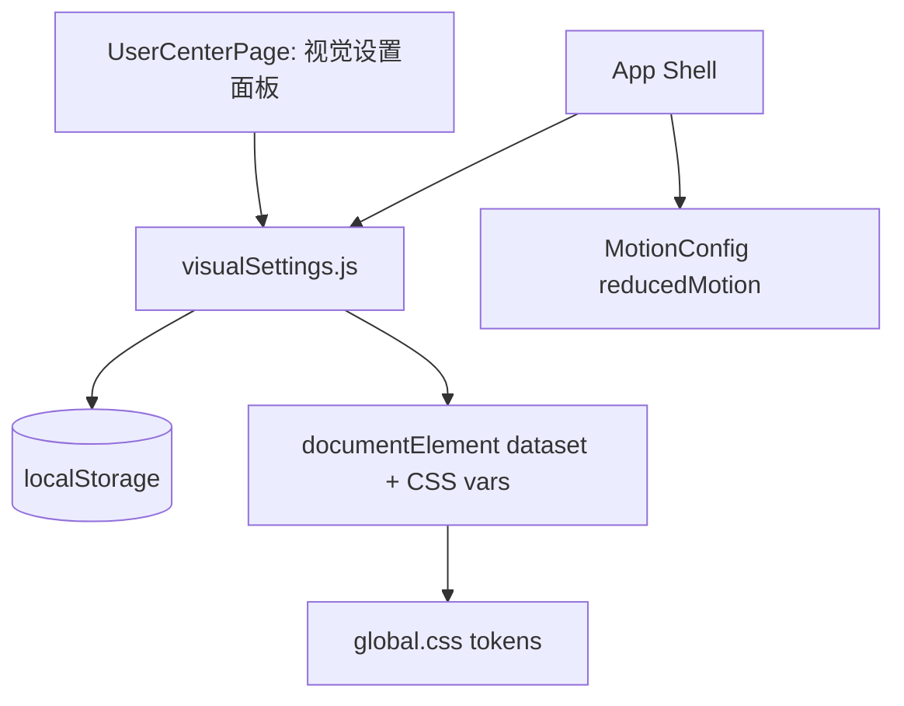

# 技术设计: 墨韵视觉进化（Visual Settings + UI 体系强化）

## 技术方案

### 核心技术

- React 18 + Vite 6（现有）
- CSS Variables Design Tokens（现有，新增少量 tokens）
- localStorage + `storageQueue`（现有，新增 1 个 settings key）
- Framer Motion（现有，用于动效策略联动）

### 实现要点

1. **新增 `visualSettings` 本地存储**
   - 新增 `STORAGE_KEYS.visualSettings`（版本化 key）
   - 数据结构使用 `schemaVersion` + `updatedAt`，可扩展、可回退

2. **视觉设置的“即时生效”与“跨页生效”**
   - 在 `src/utils/visualSettings.js` 中集中实现：
     - `getStoredVisualSettings()`：容错读取 + 默认值回退
     - `applyVisualSettings(settings)`：将设置映射为 `documentElement` 的 CSS Variables / dataset
     - `setVisualSettings(next)`：持久化（走 `storageQueue`）+ 立即 apply
     - `initVisualSettings()`：首帧初始化（在 `src/index.jsx` 中调用）
   - App 侧通过监听 `guoman:storage`（`useStorageSignal`）在跨 Tab 或导入/导出后重新 apply。

3. **CSS Tokens 收敛（支持叠加降载）**
   - 在 `global.css` 中引入以下 tokens：
     - `--paper-noise-opacity`、`--paper-noise-multiplier`
     - `--aurora-opacity`、`--aurora-opacity-multiplier`
     - `--font-scale`（配合 `--base-font-size`）
   - `data-low-data` 不再直接写死 `opacity`，改为调整 multiplier，从而与用户自定义强度“叠乘”。

4. **动效策略联动**
   - App 的 `MotionConfig reducedMotion` 从固定 `user` 变为：
     - 默认：`user`（尊重系统偏好）
     - 用户强制减少动效：`always`
   - 同时以 `data-reduced-motion` dataset 触发 CSS 低动效策略，覆盖 shimmer/过渡等非 Framer Motion 动效。

5. **User Center 增加“视觉设置”面板**
   - 使用现有样式体系（styled-components + tokens），新增：
     - 纸纹噪点强度（range）
     - 极光光晕强度（range）
     - 字号缩放（range）
     - 禁用玻璃模糊（toggle）
     - 减少动效（toggle）
     - 一键恢复默认（button）

## 架构设计

本次为“设计变量层 + 设置层”的小幅加层，不引入新模块边界，仅新增一个 util 作为集中入口：



## 架构决策 ADR

### ADR-001: 保留 styled-components 与 framer-motion（本次不做“删依赖重写”）

**上下文:** 用户目标聚焦“UI 视觉与体验”，同时要求性能与可访问性；而全量移除 `styled-components`/`framer-motion` 将导致大范围重写与较高回归风险。

**决策:** 本次保留两者，优先在现有体系内完成“可控视觉引擎”与关键页面一致性升级；后续如需“极致熵减”，再以独立方案包进行分阶段迁移（避免一次性大爆炸重构）。

**理由:**

- 风险可控：避免大面积重写造成回归
- 成本可控：将资源集中在视觉可控与一致性
- 可演进：未来仍可拆出迁移计划（按页面/组件分批）

**替代方案:** 立即迁移到原生 CSS Modules + 自研动效
→ 拒绝原因: 变更面过大，无法保证短周期内“可验证”的稳定交付。

**影响:** 依赖保留，但通过 token 收敛与设置联动，仍能提升一致性与体验，并为未来迁移提供清晰边界。

## API 设计

无对外 API，仅新增内部工具函数导出：

- `initVisualSettings()`
- `getStoredVisualSettings()`
- `applyVisualSettings(settings)`
- `setVisualSettings(partialOrNext)`

## 数据模型

`visualSettings` 存储结构（schemaVersion=1）：

```json
{
  "schemaVersion": 1,
  "updatedAt": 0,
  "paperNoiseOpacity": 0.08,
  "auroraOpacity": 0.9,
  "fontScale": 1,
  "disableBlur": false,
  "forceReducedMotion": false
}
```

## 安全与性能

- **安全:**
  - 仅本地存储，不上传敏感信息
  - 对 localStorage 读取使用容错解析与边界限制，避免异常值导致样式注入/崩溃
- **性能:**
  - `storageQueue` 合并写入，减少频繁同步写 localStorage
  - CSS 变量更新为 O(1)，避免 React 组件级 re-render 的大面积触发
  - `data-low-data` 场景下自动进一步降载（noise/aurora/blur）

## 测试与部署

- **测试:**
  - 为 `visualSettings` util 增加单元测试（默认值、容错、apply 行为）
  - 更新/扩展 Data Vault 与主题测试（新 key 纳入导出/导入）
- **部署:**
  - 沿用现有 GitHub Actions：`npm run check` 作为质量闸门
  - 产物仍为纯静态站，GitHub Pages 部署不变
