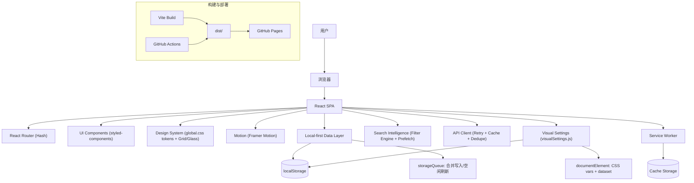
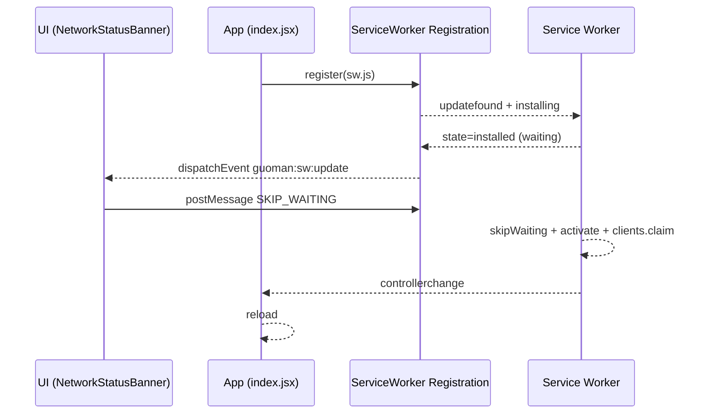

# 架构设计

## 总体架构

```mermaid
flowchart TD
  User[用户] --> Browser[浏览器]
  Browser --> App[React SPA]

  App --> Router["React Router (Hash)"]
  App --> UI["UI Components (styled-components)"]
  App --> Design["Design System (global.css tokens + Grid/Glass)"]
  App --> Motion["Motion (Framer Motion)"]

  App --> Data["Local-first Data Layer"]
  Data --> LS[(localStorage)]
  Data --> Queue["storageQueue: 合并写入/空闲刷新"]

  App --> Search["Search Intelligence (Filter Engine + Prefetch)"]
  App --> Api["API Client (Retry + Cache + Dedupe)"]

  App --> Visual["Visual Settings (visualSettings.js)"]
  Visual --> LS
  Visual --> Root["documentElement: CSS vars + dataset"]

  App --> PWA[Service Worker]
  PWA --> Cache[(Cache Storage)]

  subgraph Build[构建与部署]
    Vite[Vite Build] --> Dist[dist/]
    Actions[GitHub Actions] --> Dist
    Dist --> Pages[GitHub Pages]
  end
```

---

## 核心流程：Service Worker 更新提示

```mermaid
sequenceDiagram
  participant UI as UI (NetworkStatusBanner)
  participant App as App (index.jsx)
  participant SWR as ServiceWorker Registration
  participant SW as Service Worker

  App->>SWR: register(sw.js)
  SWR-->>SW: updatefound + installing
  SW-->>SWR: state=installed (waiting)
  SWR-->>UI: dispatchEvent guoman:sw:update
  UI->>SWR: postMessage SKIP_WAITING
  SW-->>SW: skipWaiting + activate + clients.claim
  SW-->>App: controllerchange
  App-->>App: reload
```

---

## 重大架构决策

完整 ADR 记录在变更方案包的 `how.md` 中；本章节仅作为概览索引（当前暂无独立 ADR 索引表）。
