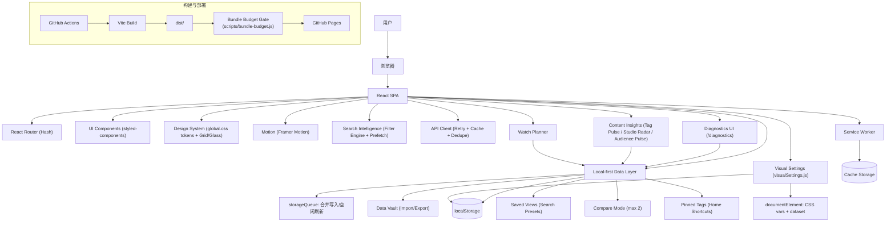
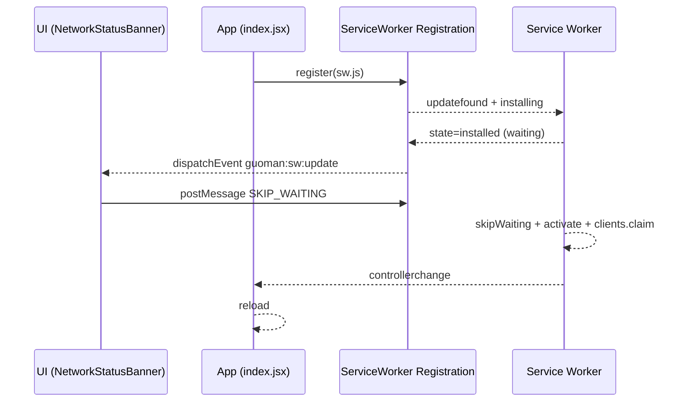

# 架构设计

## 总体架构

---

## 核心流程：Service Worker 更新提示

---

## 离线兜底：Offline Fallback

- `public/offline.html`：离线提示页（避免“白屏/无提示”的离线体验）
- `public/sw.js`：导航请求网络失败时，优先回退到缓存的 `index.html`，再回退到 `offline.html`

---

## 重大架构决策

完整 ADR 记录在变更方案包的 `how.md` 中；本章节仅作为概览索引（当前暂无独立 ADR 索引表）。
